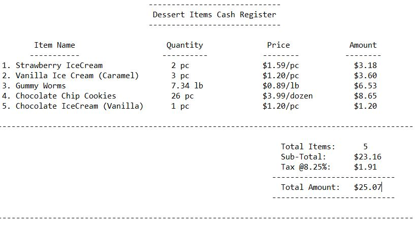
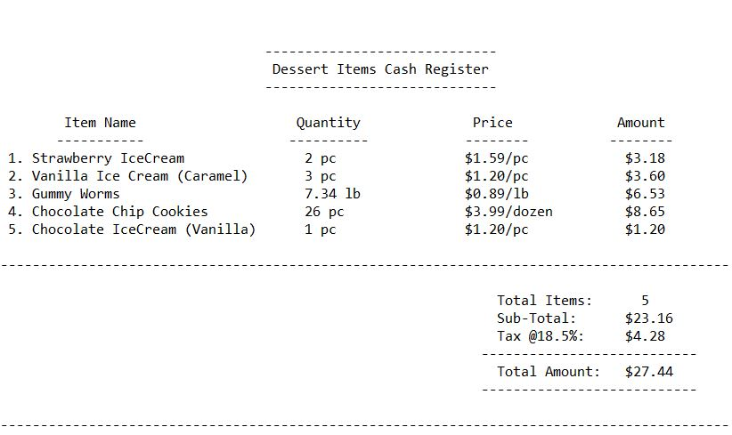

# Problem Statement:

## Inheritance/Polymorphism/Interface Assignment
* For this homework assignment, you will be writing software in support of a Dessert Shoppe which sells candy by the pound, cookies by the dozen, ice cream, and sundaes (ice cream with a topping).
*	To do this, you will implement an inheritance hierarchy of classes derived from a DessertItem superclass.
*	The Candy, Cookie, and IceCream classes will be derived from the DessertItem class.
*	The Sundae class will be derived from the IceCream class.

## The DessertItem class
*	The DessertItem class is a superclass from which specific types of DessertItems can be derived.
*	It contains only one instance variable for the name of a specific dessert item.
*	Here is the code for DessertItem: DessertItem.java.
*	The getCost() method is not defined in the DessertItem class because the method of determining the costs varies based on the type of item.

## The Derived(Child) Classes
*	The Candy class should be derived from the DessertItem class. A Candy item has a weight and a price per pound which are used to determine its cost. For example, 2.30 lbs.of fudge @ .89 /lb. = 205 cents. The cost should be rounded to the nearest cent.
*	The Cookie class should be derived from the DessertItem class. A Cookie item has a number and a price per dozen which are used to determine its cost. For example, 4 cookies @ 399 cents /dz. = 133 cents. The cost should be rounded to the nearest cent.
*	The IceCream class should be derived from the DessertItem class. An IceCream item simply has a cost.
*	The Sundae class should be derived from the IceCream class. The cost of a Sundae is the cost of the IceCream plus the cost of the topping.
*	All DessertItems have calories. You must also create the appropriate getter and setter methods for this instance variable.

## The Checkout Class
*	You will also need to write a Checkout class. This class provides methods to enter dessert items into the cash register, clear the cash register, get the number of items, get the total cost of the items (before tax), get the total tax for the items, and get a String representing a receipt for the dessert items.
*	The Checkout class must use an ArrayList to store the DessertItem's. The total tax should be rounded to the nearest cent.
*	All output from the Checkout class must display money in dollars and cents.
*	You will also need to allow for a tax rate in the Checkout class. You can add it to the constructor. Or you can create setTax() and getTax() methods to this class

# Output:

